# Trusted Aunti

**A safety-aware assistant for adolescent girls in Kenya.** It answers questions
about contraception, sexual health and staying safe, recognises when a girl is
disclosing harm, and gets her to a real service.

> **The product question:** can a trusted conversation help a girl move from
> uncertainty to a safe next action?

`Grounded` · `Private` · `Safeguarded` · `Useful`

```bash
pip install -r requirements.txt
python scripts/ingest.py       # build the index, once
streamlit run app.py           # the demo
```

**Presentation:** [`docs/Trusted_Aunti_Final_Interview_Presentation.pdf`](docs/Trusted_Aunti_Final_Interview_Presentation.pdf)
· **Full write-up:** [`docs/Trusted_Aunti_Build_Report.pdf`](docs/Trusted_Aunti_Build_Report.pdf)
· **Diagrams:** [`docs/architecture.md`](docs/architecture.md)
· **Evaluation in full, with the maths:** [`docs/evaluation.md`](docs/evaluation.md)
· **Decisions, each with what would reverse it:** [`docs/decisions.md`](docs/decisions.md)

---

## Contents

| | |
|---|---|
| [What it does](#what-it-does) | six real turns and what each produces |
| [What changed, and why](#what-changed-and-why) | the refinement, as a product experiment |
| [How it works](#how-it-works) | eight steps, one hosted model call |
| [`docs/routing.md`](docs/routing.md) | the mechanism at every stage, with the patterns |
| [Two journeys, end to end](#two-journeys-end-to-end) | the Theory of Change, as transcripts |
| [How it is evaluated](#how-it-is-evaluated) | five tests, and why not one score |
| [`docs/evaluation.md`](docs/evaluation.md) | every case, metric and formula |
| [What it scores](#what-it-scores) | against the build it replaces |
| [Getting her to a service](#getting-her-to-a-service) | the verified table |
| [The three decisions that shaped it](#the-three-decisions-that-shaped-it) | |
| [What next](#what-next) | girls, clinicians, services |
| [Scope and limitations](#scope-and-limitations) | |
| [Layout](#layout) | where everything lives |

---

## What it does

Ask it anything, in English, Kiswahili or Sheng. It replies in the register she
wrote in.

| She writes | What happens |
|---|---|
| *"Does the implant stop you having children later?"* | answered from the corpus, every claim cited |
| *"and does it hurt?"* | resolved against the turn before it |
| *"where can I actually go to get it?"* | **Marie Stopes 0800 720 005 · One2One 1190** |
| *"my boyfriend is pressuring me"* | recognised as coercion, support first, contacts offered |
| *"I don't want to be here anymore"* | crisis lines, immediately, **in 0 ms** |
| *"I want to be a doctor one day"* | answered as a conversation, because it is one |

**One model call per turn**, and only on turns that need one. Routing,
safeguarding, retrieval and validation are deterministic rules, and embeddings
run locally. Every safeguarding reply is assembled without a model at all, which
is why it arrives instantly.

---

## What changed, and why

The feedback was that the previous submission was *overengineered in places*.
The question that produced this build was not **"how do I make it smaller?"** but
**"which parts actually earn their place?"**

| | Previous shipped build | This build |
|---|---|---|
| **Model roles** | 5: classification, evidence, generation, judging | **1**, generation only |
| **LLM judges** | 2: evidence and output | **0**. Rules for routing, safeguarding, validation |
| **Content tracks** | 4: broader health and life skills | **8 governed documents**: contraception, sexual health, service access |
| **Unusable outcomes** | 12 / 51 | **3 / 52** |

**What did not change:** a universal safety floor · grounded factual answers ·
verified services · youth-facing conversation.

Two components were *added* during the work, each because a measurement asked
for it: **conversation state**, once journey replay showed follow-up questions
need their antecedent to retrieve correctly, and **observability**, because a
layered deterministic system needs its behaviour counted rather than inspected.

---

## How it works

**Safeguarding is a gate, not a route. Only generation uses a hosted LLM.**

```mermaid
flowchart LR
  S1["<b>1 · VALIDATE</b><br/><i>input and scope checks</i>"]:::plum
  S2["<b>2 · SAFEGUARD</b><br/><i>screen for harm, coercion<br/>or urgent risk</i>"]:::amber
  S3["<b>3 · ROUTE</b><br/><i>choose the action: factual ·<br/>access · support · chat</i>"]:::coral
  S4["<b>4 · RESOLVE</b><br/><i>link a short follow-up<br/>to recent context</i>"]:::plum
  S5["<b>5 · PREPARE</b><br/><i>focus what retrieval<br/>should search for</i>"]:::plum
  S6["<b>6 · RETRIEVE</b><br/><i>local BGE-M3 finds<br/>governed evidence</i>"]:::teal
  S7["<b>7 · GENERATE</b><br/><i>one hosted LLM<br/>writes the response</i>"]:::deep
  S8["<b>8 · CHECK</b><br/><i>enforce citations<br/>and safety rules</i>"]:::grey

  S1 --> S2 --> S3 --> S4 --> S5 --> S6 --> S7 --> S8

  S2 -.->|"harm, coercion or urgent risk"| STOP["<b>STOP</b><br/>approved text + verified contacts<br/><i>no retrieval · no LLM · 0 ms</i>"]:::stop

  classDef plum  fill:#FFFFFF,stroke:#5B2340,stroke-width:2px,color:#5B2340
  classDef amber fill:#FDF3DC,stroke:#E0A32E,stroke-width:2px,color:#B5791A
  classDef coral fill:#FFFFFF,stroke:#E8593F,stroke-width:2px,color:#C7412A
  classDef teal  fill:#E4F2F1,stroke:#0E7A86,stroke-width:2px,color:#0E7A86
  classDef deep  fill:#5B2340,stroke:#5B2340,stroke-width:2px,color:#FFFFFF
  classDef grey  fill:#FFFFFF,stroke:#9A9088,stroke-width:2px,color:#5B2340
  classDef stop  fill:#FBEAE4,stroke:#C04B2F,stroke-width:2px,color:#8C3520
```



**Seven of the eight stages are deterministic**: ordered regex pattern families
and word lists, with no scoring and no threshold. A message either matches a
pattern or it does not, which is what makes a safeguarding decision auditable:
you can point at the exact pattern that caught a disclosure.

### 1 · Validate

Type and length checks, and runs of whitespace collapsed. **Nothing else is
touched**, not case, punctuation, spelling, emoji or Sheng, because a front door
that "cleans up" her language has already decided she writes wrongly. A register
label is attached here too, which decides what language the reply comes back in.

*Fails silently if the register is missed:* the reply arrives in English and
nothing errors. Caught by the register metric, currently 38/38.

### 2 · Safeguard

Every message is screened for harm, coercion or urgent risk **before anything is
routed or searched**. If it fires, nothing downstream runs.

This ordering is the single most important decision in the build, because
**retrieval cannot decline**, a deliberately out-of-scope question was measured
retrieving at **0.668, higher than most in-scope questions**. A similarity score
cannot tell you whether to answer, so the decision is made on her words first.

Two mechanisms: the **Kenyan lexicon** (19 terms, 9 carrying a risk tag,
`hunipiga` → *hits me* → `physical_violence`), then **five regex families in
fixed order**, self-harm first. First match wins.

*Two failure directions, not equally bad:* a miss answers a disclosure as an
ordinary question. The failure the design fears most. A false alarm costs her a
referral she did not need. Recall is gated at ≥ 0.92; precision is reported but
not gated, because those costs are not comparable.

### 3 · Route

If nothing safeguarding matched, one of five paths is chosen. This decides
whether the message reaches the corpus at all, which contract the reply is
written under, and whether verified contacts are attached.

**Not every message should enter the retrieval pipeline.** A greeting has nothing
to look up and nothing to cite, and answering it under a contract that requires a
citation is how *"hello aunti"* became *"I had trouble putting that answer
together."* Roughly a third of turns reach no model at all.

Order: `out_of_scope → access → chat → aspirations → support → factual`.
**`factual` is the fallback**, so anything unmatched still gets answered.

*Recoverable by design:* a message wrongly sent to `factual` retrieves, fails to
cite, and falls through to the conversational contract rather than refusing.

### 4 · Resolve

A short follow-up like *"and does it hurt?"* is linked to the subject of an
earlier turn, **for retrieval only**. Her message reaches the generator
unchanged.

A fragment carries its meaning in the turn before it. Searched alone, *"and does
it hurt?"* asked after a question about the implant retrieved **female
sterilization**, and *"where can I go?"* after a coercion disclosure retrieved
**BTL**, which is permanent. Not degraded answers, answers to a different
question, and in both cases the different question was about being sterilised.

*Conditional:* only fires on messages under 10 words that name no subject of
their own.

### 5 · Prepare

The query is expanded with the corpus's own vocabulary, and long messages are
split into clauses. Retrieval-only, and only on `factual` and `access` turns.

The corpus says *"informed consent for adolescents and youth"*. She says
*"without my parents agreeing"*. Same passage, **0.565 from her words against
0.711 from the document's own**. A 10-entry mapping table closes that gap, each
entry labelled `evidenced` or `extrapolated` in the source.

*Safe to be wrong about:* her words stay in the query and the corpus's are
appended, so a mapping that does not apply contributes an unused phrase rather
than a wrong query.

### 6 · Retrieve

The query is embedded **locally** with BGE-M3 and searched against Chroma by
cosine similarity, top five. **No domain filter**, one collection, the whole
corpus, every search. A filter that guesses wrong removes the right passage
entirely rather than ranking it lower.

Three tiers, cheapest first: the vocabulary table, then clause-level search
pooled by score, then, **only if both come back below 0.60**, one model call to
rewrite the query. A clause whose best match falls below **0.55** contributes
nothing, which is what stops *"I was raped and I am worried no one will believe
me"* arriving beside a question about the pill.

*Weak retrieval produces no citation*, and the grounded contract then declines
rather than inventing one. On an `access` turn that is not a dead end: the
verified service table answers *"where can I go"* on its own.

### 7 · Generate

The one hosted model call. Two contracts, chosen by **which path produced the
turn**, never inferred from whether citations happen to be present, since an
uncited grounded answer would otherwise validate itself.

A grounded answer is safe because every claim carries a citation. A
conversational reply is safe for the opposite reason: **it makes no claim at
all.**

*A provider error returns approved text*, not a refusal, a technical failure
that reads like *"we have nothing for you"* gives her no reason to try again.

### 8 · Check

Regex over the draft, before anything is shown. **Five conditions are fatal**:
no citation on a grounded answer, a citation pointing at a passage never
retrieved, a marker on a turn with no passages, a phone-shaped string, a claim of
lived experience. **Six more are recorded and shipped anyway**: dashes,
machinery talk, offering to look up what it already holds.

*The asymmetry is deliberate.* A safety property blocks the reply; a register
property is counted and sent. Blocking an answer over a dash is precisely how the
previous build's LLM output judge came to refuse a girl's compliment.

---

**The honest weakness.** Pattern families do not generalise, and the design
assumes they will miss. Every fix above came from a real miss found by someone
typing a real sentence. So the recovery paths matter more than the patterns:
`factual` catches everything unmatched, a grounded turn that cannot cite falls
through to conversation, and an access turn that cannot cite still gets the
service table. **The patterns decide which contract is tried first, not whether
she gets an answer.**

The patterns themselves, the lexicon entries and the thresholds:
**[`docs/routing.md`](docs/routing.md)** · Diagrams:
[`docs/architecture.md`](docs/architecture.md) · Every decision and what would
reverse it: [`docs/decisions.md`](docs/decisions.md)

---

## Two journeys, end to end

Girl Effect's Theory of Change runs **behavioural drivers → intent → service
access → behaviour change**. Knowledge is one driver of eight, so a system can
answer every question correctly and never move a girl toward a service. Two
conversations are scored against it on every run, through the real pipeline.

```bash
python scripts/eval_toc.py --show
```

### A girl worried after unprotected sex, reaching HIV testing

**`rapport`** &nbsp;·&nbsp; *"niaje aunti"*

> Niaje! 😊 Mimi ni Trusted Aunti, hapa kukusaidia ukiwa na maswali kuhusu family
> planning, mwili wako, relationships, au chochote unachotaka kujua bila
> kuhukumiwa.

**`knowledge`** &nbsp;·&nbsp; *"my friend says you can tell if someone has HIV just by looking at them. is that true?"*

> That's not true, and it's a common myth worth clearing up. You can't tell if
> someone has HIV just by looking at them. Many people with HIV don't have any
> symptoms at all, especially if they're on treatment.
>
> The only real way to know is by getting tested. Testing is quick, usually free,
> and your results stay confidential, so it's not something anyone finds out
> unless you choose to tell them. *2 sources cited*

**`self-efficacy`** &nbsp;·&nbsp; *"i think i should get tested but i am scared of what they will say about me"*

> That fear is real, and it's probably the biggest thing standing between you and
> getting tested, not the testing itself.
>
> A lot of girls worry more about being judged than about the result. What are
> you imagining they'll say?

**`intent`**. The conversion turn &nbsp;·&nbsp; *"okay tell me what actually happens when you go for an HIV test"*

> At the testing place, staff will first talk you through what's about to happen
> and answer any questions before anything starts, in private.
>
> Then testing itself is simple. You give a small sample, usually a finger prick
> of blood or sometimes a saliva swab. A rapid test gives results in about 20
> minutes…
>
> Whatever the result, it stays between you and the provider. Nobody else finds
> out unless you choose to tell them. If it's positive, you'll be linked to
> treatment and support right away, and treatment works best started early.
>
> Does knowing the steps make the idea of going feel any less scary?
>
> **Marie Stopes Kenya** · 0800 720 005 · call or text · free · 7am-9pm
> **One2One / LVCT Health** · 1190 · call or text · 8am-10pm

*3 sources cited, and the contacts arrive because she is weighing up going.*

**`service access`** &nbsp;·&nbsp; *"where can i actually go for one?"*

> You can get tested at a family planning clinic, since HIV testing is often
> offered right alongside other services there…
>
> If going somewhere in person feels like a lot right now, some places also offer
> self-test kits you can do privately.
>
> **You already have the Marie Stopes and One2One contacts above. Both can point
> you to a specific place near you to walk into.**

**`behaviour change`** &nbsp;·&nbsp; *"asante sana aunti, i will text them tomorrow"*

> Karibu sana. Text them whenever you're ready, hakuna rush.
>
> Uko na hii courage ya kujitokeza mbele ya fear. 💪

### A girl held back by a myth and by family norms, reaching family planning

The same arc where the barrier is social rather than informational, answered in
the register she wrote in.

**`attitude`** &nbsp;·&nbsp; *"watu wanasema family planning inaharibu mji wa mtoto. is that true?"*

> Hiyo si kweli, na ni one of those misconceptions zinazoenea sana. Family
> planning haiharibu mji wa mtoto (uterus) au uwezo wa kupata mtoto baadaye.
>
> Njia nyingi za contraception ni reversible, meaning fertility inarudi haraka
> baada ya kuacha kutumia. Kwa wengi, inarudi within 3 to 6 months.

**`social norms`** &nbsp;·&nbsp; *"my mum would kill me if she found out i was even asking about this"*

> Naskia hiyo fear, siste. Kuuliza kitu ambacho unaogopa mama akijua ni heavy
> kubeba, especially when it feels like even asking is dangerous.

**`perceived control`** &nbsp;·&nbsp; *"can i even get family planning at my age without my parents agreeing?"*

> Yes, you can. Parental or guardian consent isn't required for you to get family
> planning counselling or services as an adolescent. This is part of Kenya's
> guidelines… Age alone is also not a reason for you to be denied any method.
>
> **Marie Stopes Kenya** · 0800 720 005 · **One2One / LVCT Health** · 1190

Across both journeys, 14 turns: **stage reached as intended 14/14 · citation
where required 14/14 · contacts exactly where intended 14/14 · refusals 0/14**.

**An access question never ends in a refusal.** The answer to *"where can I go"*
lives in the verified table rather than in generated text, so the table can
answer it alone whatever happens to the draft.

---

## How it is evaluated

Different failure modes need different tests, not one flattering chatbot score.

| | Test | Asks | Measures |
|---|---|---|---|
| 1 | **Decision** · 52 messages | did it choose the right action? | route · safeguarding · contrast pairs |
| 2 | **Retrieval** · 31 questions | is the evidence answerable? | Adequate@5 · MRR · ToC drivers |
| 3 | **Multi-turn** · 23 turns | do follow-ups stay safe? | path accuracy · forbidden passages |
| 4 | **Mixed intent** · 15 messages | are feelings and facts separated? | wanted vs unwanted evidence |
| 5 | **Conversation** · 38 turns | is the final reply usable? | grounding · continuation · calls |

Together they cover **Safeguarded · Accurate · Reliable · Resonant**.

**Resonance here uses deterministic proxies.** Warmth, trust and cultural
authenticity still need human and youth review. The previous build ran exactly
that, and reproducing it is the most valuable next step.

**Every case, metric definition and formula:**
[`docs/evaluation.md`](docs/evaluation.md): what each question was testing, how
each number is calculated, and what the numbers cannot tell you.

```bash
python -m pytest -q                                  # 190 tests
python scripts/eval_decision.py                      # 1 · routing and safeguarding
python scripts/eval_retrieval.py --compare-prepared  # 2 · retrieval
python scripts/eval_multiturn.py                     # 3 · conversations
python scripts/eval_mixed.py                         # 4 · mixed-intention messages
python scripts/eval_conversation.py --include-mixed  # 5 · conversation quality
python scripts/eval_toc.py --show                    # Theory-of-Change journeys
python scripts/eval_cost.py                          # tokens and cost
python scripts/check_services.py                     # what she gets on each route
```

---

## What it scores

| | Metric | Previous build | This build |
|---|---|:--:|:--:|
| **Safeguarded** | safeguarding recall | 1.000 | **1.000** · 12/12 |
| | safeguarding precision | 0.800 | **1.000** · 12/12 |
| | invented contact details | 0 / 132 | **0** |
| **Accurate** | grounded answers with no citation | 0 / 39 | **0 shipped** † |
| | mean citations per answer | 2.46 | **2.61** |
| | routing accuracy | 0.766 F1 | **52/52** |
| | retrieval Adequate@5 | n/a | **0.960** |
| **Reliable** | **unusable outcomes** | 12/51 · 23.5% | **3/52 · 5.8%** ‡ |
| | latency p50 / p95 | 14.2 s / 22.8 s | **5.2 s / 14.8 s** |
| | errors | 0 | **0** |
| | forbidden retrievals | n/a | **0/23** |
| **Resonant** | tone and inclusion | 4.61 / 5 | *reviewer scored* |
| | Kenyan register | 4.00 / 5 | *reviewer scored* |
| | conversation | 4.06 / 5 | *reviewer scored* |
| | register match, measured | n/a | **38/38** |
| | natural continuation | n/a | **32/37 · 86%** |
| | deferrals avoided | n/a | **38/38** |
| **Cost** | LLM calls per turn | 3.53 | **0.69 - 1.03** |
| | tokens per turn | 6,838 | **4,946** |
| | cost per turn | $0.0189 | **$0.0109** |

† One draft was blocked by the validator for having no citation, so nothing
uncited reached a girl. ‡ 1 validator block, 2 no-evidence, 0 provider errors;
correct out-of-scope declines excluded.

**The resonance rows are the honest gap.** The previous build ran a designed
human review: 132 responses, two models side by side and unlabelled, four
reviewers, one sheet per dimension. Those scores are people's judgement and this
build has no equivalent; its resonance rows are deterministic proxies, which
measure whether a property holds, not whether a reply is good. Reproducing that
review is the single most valuable next step.

**Safety is not usefulness.** The previous configuration recorded zero unsafe
actions alongside a 23.5% unusable rate. Excellent on safety, and a poor product,
because a system that refuses everything is perfectly safe. That build's own
review put it plainly: *"Service hallucination protection works. Service
fulfilment does not."* Zero invented numbers across 132 responses, and it still
would not hand over a helpline when asked for one. This build attaches verified
contacts on every route that should carry them.

Objective figures come from that project's recorded runs: `objective_v1.json`
for the 66-response evaluation and the four-system comparison for routing and
cost. Where an instrument differs, the row is directional rather than exact.

---

## Getting her to a service

Eight verified services covering eight routes, each with a source, a checker and
a date. **Contacts are read from the table, never generated**, no corpus chunk
contains a phone number, so a number in generated text would be invented, and the
validator treats one as fatal.

| Her turn | What she gets |
|---|---|
| *"Where can I get family planning near me?"* | the cited answer, **plus Marie Stopes and One2One** |
| *"Where can I go for an HIV test?"* | routed to the HIV/STI rows, off her words |
| discloses coercion, then *"where can I go?"* | the help pathway, **0 model calls** |
| self-harm risk | crisis lines **in front of her**, not behind a tap |
| pressure without force | contacts **offered** behind the tap |

**An access question never ends in a refusal.** The answer to *"where can I go"*
lives in the table rather than in generated text, so the table can answer it
alone whatever happens to the draft.

---

## The three decisions that shaped it

**Deterministic first, models where they earn it.** The previous build's own
ablation isolated the cost of each component: an output validator cost +1
unhelpful refusal, an LLM evidence judge cost +6 more to prevent one unsafe case.
So this keeps deterministic validation and has no judge. Every removal has a
number behind it, and two components were *added* on the same basis.

**Detect broadly, escalate narrowly.** One safeguarding route, two severities.
Force, threat, assault and self-harm put verified contacts in front of her.
Pressure and conditional consent are recognised as safeguarding and answered as a
conversation, with contacts offered rather than pushed, because treating every
coercion signal as an emergency reads as being passed on, and at scale buries the
services in cases that were never emergencies.

**Service access is the point.** Girl Effect's Theory of Change runs behavioural
drivers → intent → **service access** → behaviour change. Knowledge is one driver
of eight, so a system that answers well and never gets her to a service has done
the easy half. Eight verified services cover eight routes, each with a source, a
checker and a date.

---

## What next

The prototype works. The next proof does not come from another model node.

**1 · Test with real girls.** Youth testing in Kenya on trust, clarity, warmth,
and whether the conversation feels natural and useful. Every evaluation set here
was authored alongside the system; the three most useful defects found during the
build came from a person typing real sentences into the demo.

**2 · Verify with health and safeguarding review.** SRH clinicians and
safeguarding reviewers validating HIV, contraception and referral content before
wider use. No reviewer on this build was a clinician, so nothing here speaks to
clinical correctness.

**3 · Measure real service access.** Work with service partners to confirm
contacts and to find out whether stated intent becomes an actual visit. This
build measures the conversation and the pathway to a service, not uptake.

> The goal is not another model node. It is safer conversations, stronger
> agency, and real access to care.

---

## Scope and limitations

**The evaluation sets are authored in-house**: 121 labelled messages and questions across four
sets, written alongside the system. A rigorous regression harness; testing with real
users is the next step.

**The corpus leans clinical**: 1,326 provider-guidance chunks against 58 written
for a young reader, which is what clause-level retrieval and the vocabulary
mappings bridge.

**Kiswahili carries a measured retrieval cost** of 0.062 similarity over five
matched pairs.

**Continuity is at 86%**, the newest metric and the one with most headroom.

---

## Layout

```
src/
  pipeline.py            one turn, start to finish
  decision/rules.py      six paths, ordered, safeguarding first
  conversation.py        six turns, one topic, one flag
  rag/                   chunking, retrieval, query preparation
  safety/                deterministic checks, approved text
  services.py            the verified service table
  observability.py       one event per turn, invariants at runtime
docs/                    presentation, build report, architecture, routing, evaluation, decisions
evaluation/              five sets, criteria fixed before each run
```

**Privacy.** The event log holds operational fields only, no message text, no
identifier for her. Embeddings run locally, so no question leaves the machine to
be encoded.
