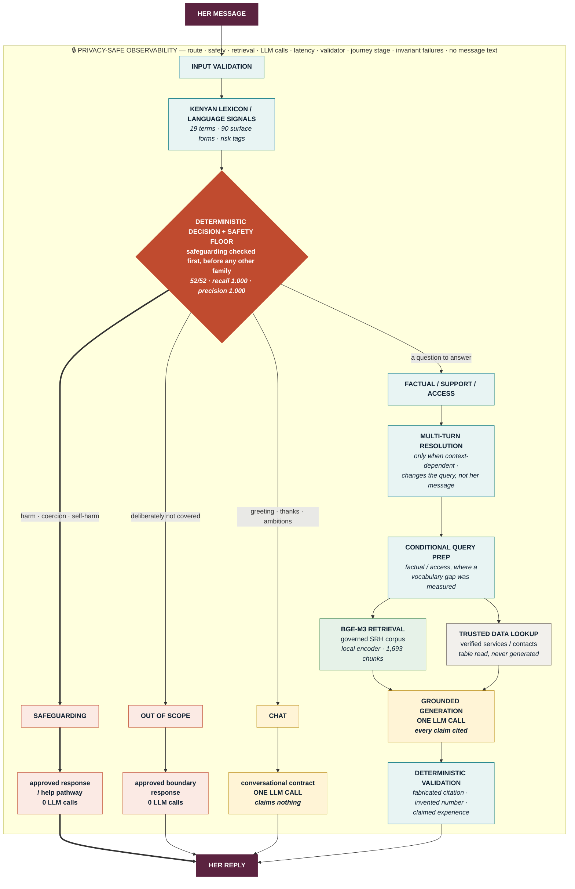
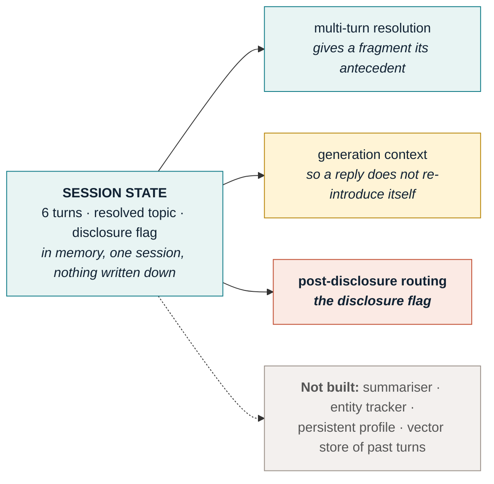
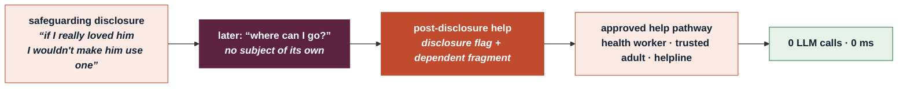
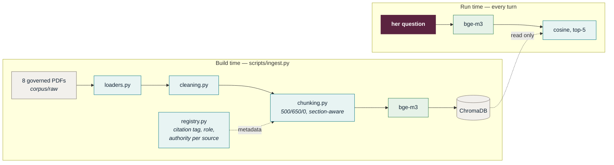
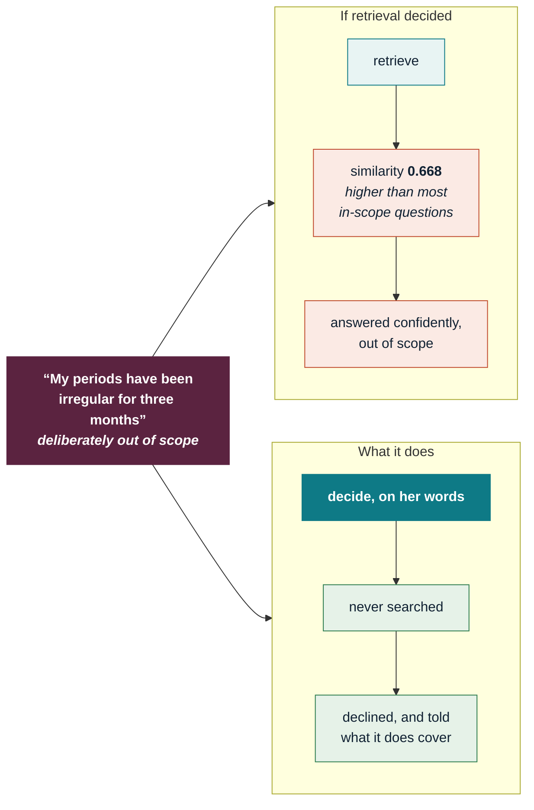
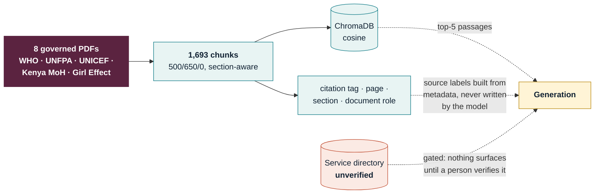

# Architecture

## The product architecture

Not every message passes through every stage. **That is the architecture** — the
branching is the design, not an implementation detail underneath it.

Only generation uses a hosted generative LLM. All routing, safeguarding, query
preparation and validation are deterministic; **embeddings run locally**, which
is compute rather than a rule and is why the encoder has a measurable cold start.

| | |
|---|---|
| **rust** | the safeguarding gate, and every reply written from approved text |
| **pale teal** | deterministic — free, instant, auditable by reading it |
| **green** | local compute — the encoder. No token cost, but not a rule either |
| **gold** | a hosted LLM call. One, or none |

**Observability is not a stage.** It wraps the runtime and records what each
turn did — route, safety outcome, retrieval, LLM calls, latency, validator
issues, journey stage, invariant failures. It holds no message text by default.
It has already paid for itself twice: it surfaced a **39.5 s cold encoder load**
hiding behind a 5.4 s median, and the **service-access gap** — the Theory of
Change's terminal stage returning nothing.

---

## Session state is a supporting component, not a stage

No turn "passes through" session state. Three things consult it, and each one is
gated on a condition.

---

## Safeguarding to service access, without a model

The branch the use case turns on. She discloses, and later asks where to go —
and that second question is not a contraception question.

Before this existed, that turn resolved against her earlier question about the
**implant**, searched implant passages, found nothing about *where*, and
refused — at the exact moment she asked for help. A rehearsal found it; no unit
test would have, because every component was behaving correctly.

---

## Build time and run time are separate

Ingestion happens once. Nothing at run time writes to the corpus.

Source labels shown to a girl are built from **metadata**, never from anything
the model wrote — which is what makes a fabricated source name impossible rather
than merely discouraged.

---

## The safety floor runs before retrieval

This is the single most important ordering decision in the build.

**Retrieval cannot decline.** It returns the nearest text, which is its job.
Asked *"am I too young to be thinking about protecting myself?"*, the second
result was *"I was raped and I am worried that no one will believe me."* That is
not a retrieval bug — it is the argument for a component above the retriever
whose only job is deciding whether to answer, running **before** the search,
because the similarity scores give it nothing to work with.

---

## Two output contracts

Which contract a reply is written under is decided by **provenance** — never
inferred from whether citations happen to be present.

---

## Where the evidence comes from

**Zero of the 1,693 chunks contains a phone number**, so any number in a
generated answer is invented by definition — and the validator treats a
phone-shaped string as fatal. Contacts are a table read, never generated, and
the table is gated on human verification.

---

## What each component had to prove

| Component | Kept or cut | The measurement |
|---|---|---|
| Decision layer | **kept** | 52/52, safeguarding recall and precision both 1.000 |
| Safety floor before retrieval | **kept** | an out-of-scope question retrieved at 0.668, above most in-scope ones |
| Deterministic validator | **kept** | catches fabricated citations and invented phone numbers, free |
| Query preparation | **kept** | Adequate@5 0.880 → 0.960, zero regressions, zero tokens |
| Conversation state | **kept** | a follow-up about the implant retrieved *female sterilization* without it |
| Observability | **kept** | three defects in one afternoon, all found by hand |
| LLM evidence judge | **cut** | +6 unhelpful refusals to prevent one unsafe case |
| LLM output judge | **cut** | refused a girl's compliment, twice |
| LLM turn planner | **cut** | rules beat it at 52/52 |
| LLM query rewriter | **not built** | a string table already got 0.960 for nothing |
| Source role preference | **rejected** | moved youth material up without improving what answers could support |
| Automatic restatement | **refused** | helped factual turns, actively harmed support and out-of-scope ones |

Full reasoning, each with what would reverse it: [`decisions.md`](decisions.md).
