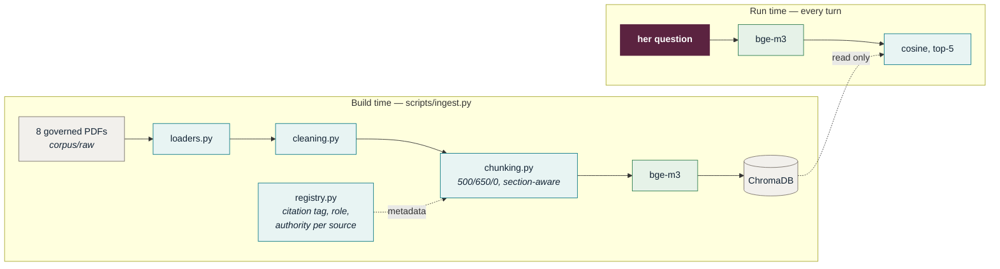
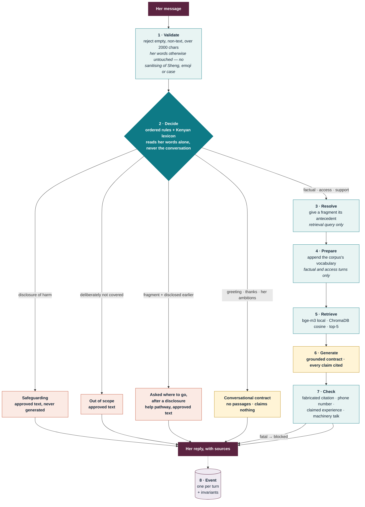
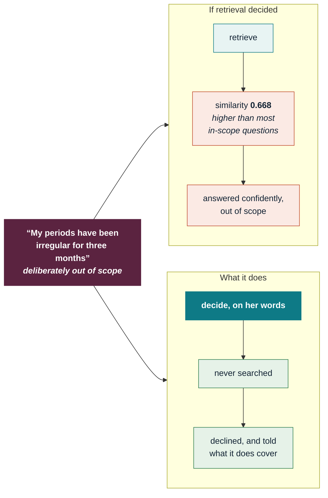
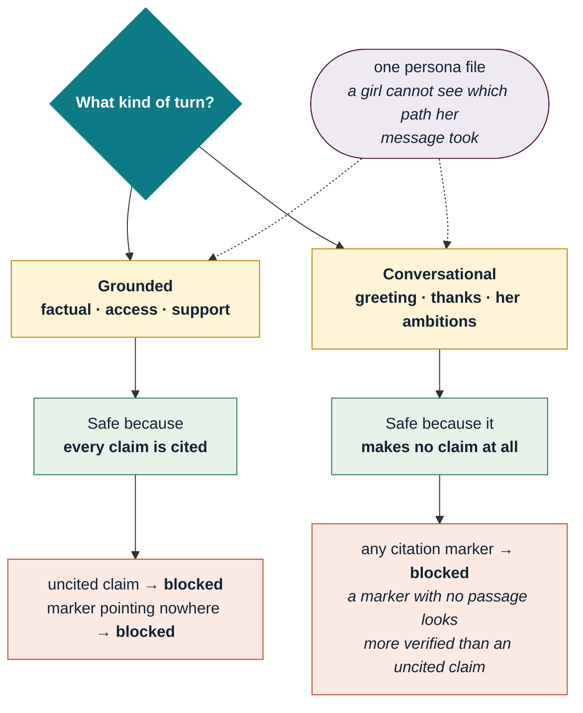
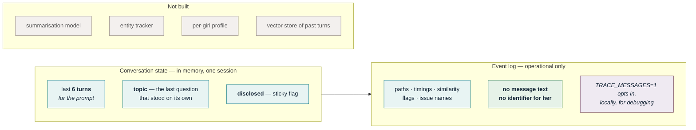
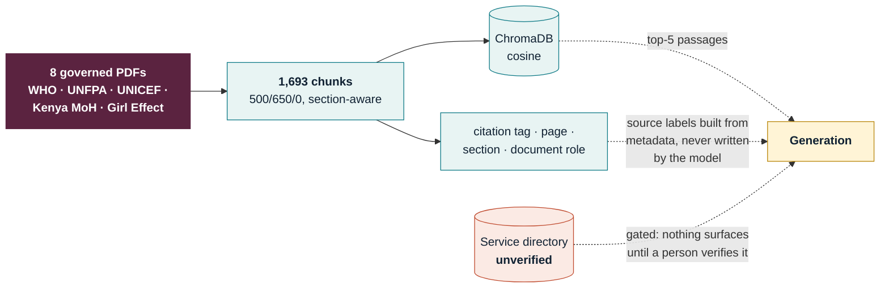

# Architecture

## Solution architecture

Six layers, four data stores, **one external dependency**. Everything shaded
teal is deterministic — it costs nothing, runs instantly, and can be audited by
reading it.

```mermaid
flowchart TB
    subgraph UI["Interface"]
        APP["<b>app.py</b> · Streamlit<br/>ui/theme.py"]:::iface
    end

    subgraph ORCH["Orchestration"]
        PIPE["<b>pipeline.py</b><br/><i>one turn, start to finish</i>"]:::orch
    end

    subgraph DEC["Decision · deterministic"]
        IV["input_validation.py<br/><i>the front door</i>"]:::free
        RU["<b>rules.py</b><br/><i>6 paths, ordered</i>"]:::free
        GL["language/glossary.py<br/><i>Kenyan lexicon</i>"]:::free
    end

    subgraph CST["Conversation · deterministic"]
        CV["<b>conversation.py</b><br/><i>6 turns · topic · disclosed</i>"]:::free
    end

    subgraph RAGL["Retrieval · deterministic"]
        QP["query_prep.py<br/><i>vocabulary mapping</i>"]:::free
        RT["retrieval.py<br/><i>cosine, top-5</i>"]:::free
        IX["indexing.py"]:::free
    end

    subgraph GENL["Generation · the only model call"]
        PR["prompt_files/<br/><i>persona · answer · converse</i>"]:::model
        LC["llm/client.py"]:::model
    end

    subgraph SAF["Safety · spans every path"]
        CK["checks.py<br/><i>validation, no model</i>"]:::approved
        RS["responses.py<br/><i>approved text</i>"]:::approved
    end

    subgraph OBSL["Observability"]
        OB["observability.py<br/><i>events + invariants</i>"]:::obs
    end

    CHR[("<b>ChromaDB</b><br/>1,693 chunks")]:::store
    LEX[("kenyan_lexicon<br/>.json")]:::store
    SVC[("services.csv<br/><b>unverified · gated</b>")]:::gated
    EVT[("events.jsonl<br/><i>no message text</i>")]:::store

    BGE["<b>BAAI/bge-m3</b><br/><i>embeddings, on this machine</i>"]:::local
    OR["<b>OpenRouter</b><br/>claude-sonnet-5<br/><i>the only network call</i>"]:::ext

    APP --> PIPE
    PIPE --> DEC
    PIPE --> CST
    PIPE --> RAGL
    PIPE --> GENL
    PIPE --> SAF
    PIPE -.-> OBSL

    GL -.-> LEX
    RT --> IX --> CHR
    IX --> BGE
    LC --> OR
    RS -.-> SVC
    OB -.-> EVT

    classDef iface fill:#5B2340,stroke:#5B2340,color:#fff,font-weight:bold
    classDef orch fill:#0E7A86,stroke:#0E7A86,color:#fff,font-weight:bold
    classDef free fill:#E8F4F3,stroke:#0E7A86,color:#123
    classDef model fill:#FFF4D6,stroke:#B8860B,color:#123
    classDef approved fill:#FBEAE4,stroke:#C04B2F,color:#123
    classDef obs fill:#EFEAF2,stroke:#5B2340,color:#123
    classDef store fill:#F2F0EC,stroke:#7A736B,color:#123
    classDef gated fill:#FBEAE4,stroke:#C04B2F,color:#123,font-weight:bold
    classDef local fill:#E6F2E8,stroke:#2E7D4F,color:#123
    classDef ext fill:#FFF4D6,stroke:#B8860B,color:#123,font-weight:bold
```

**Three properties worth naming.**

**One external dependency.** Only generation leaves the machine. Embeddings run
locally on `bge-m3`, so there is no per-query embedding cost and no girl's
question is sent anywhere to be encoded. If OpenRouter is down, every
safeguarding reply still works, because those never needed it.

**Safety is a layer, not a step.** `responses.py` and `checks.py` are reachable
from every path rather than sitting at one point in a sequence. A disclosure is
answered from approved text without touching retrieval or generation.

**The service table is gated, not just present.** Nothing in `services.csv`
reaches a girl until a person has verified it. It is currently unverified, so
the system refuses to surface it — which is the correct behaviour, not a gap.

---

## Build time and run time are separate

Ingestion happens once. Nothing at run time writes to the corpus.

Source labels shown to a girl are built from **metadata**, never from anything
the model wrote — which is what makes a fabricated source name impossible rather
than merely discouraged.

---

## How one turn moves through it

Eight steps end to end. **One of them costs money.**

| Colour | Meaning |
|---|---|
| pale teal | deterministic — free, instant, auditable |
| pale rust | human-approved text, never generated |
| pale gold | the model. One call, or none |
| plum | her, and the sources |

**Roughly a third of turns never reach a model at all**, and they are the turns
where that matters most: every safeguarding reply is instant, because a girl who
has just disclosed coercion should not wait on a network round trip.

---

## The safety floor runs before retrieval

This is the single most important ordering decision in the build.

**Retrieval cannot decline.** It returns the nearest text, which is its job.
Asked *"am I too young to be thinking about protecting myself?"*, the second
result was *"I was raped and I am worried that no one will believe me."* That is
not a retrieval bug — it is the argument for a component above the retriever
whose only job is deciding whether to answer, running **before** the search,
because the similarity scores give it nothing to work with.

---

## Two output contracts

Which contract a reply is written under is decided by **provenance** — never
inferred from whether citations happen to be present.

---

## State, and what is deliberately not stored

An event log for a safeguarding product, kept by default, is a surveillance
database with a dashboard on top — and the girls most at risk from it are the
ones the product exists for.

---

## Where the evidence comes from

**Zero of the 1,693 chunks contains a phone number**, so any number in a
generated answer is invented by definition — and the validator treats a
phone-shaped string as fatal. Contacts are a table read, never generated, and
the table is gated on human verification.

---

## What each component had to prove

| Component | Kept or cut | The measurement |
|---|---|---|
| Decision layer | **kept** | 52/52, safeguarding recall and precision both 1.000 |
| Safety floor before retrieval | **kept** | an out-of-scope question retrieved at 0.668, above most in-scope ones |
| Deterministic validator | **kept** | catches fabricated citations and invented phone numbers, free |
| Query preparation | **kept** | Adequate@5 0.880 → 0.960, zero regressions, zero tokens |
| Conversation state | **kept** | a follow-up about the implant retrieved *female sterilization* without it |
| Observability | **kept** | three defects in one afternoon, all found by hand |
| LLM evidence judge | **cut** | +6 unhelpful refusals to prevent one unsafe case |
| LLM output judge | **cut** | refused a girl's compliment, twice |
| LLM turn planner | **cut** | rules beat it at 52/52 |
| LLM query rewriter | **not built** | a string table already got 0.960 for nothing |
| Source role preference | **rejected** | moved youth material up without improving what answers could support |
| Automatic restatement | **refused** | helped factual turns, actively harmed support and out-of-scope ones |

Full reasoning, each with what would reverse it: [`decisions.md`](decisions.md).
